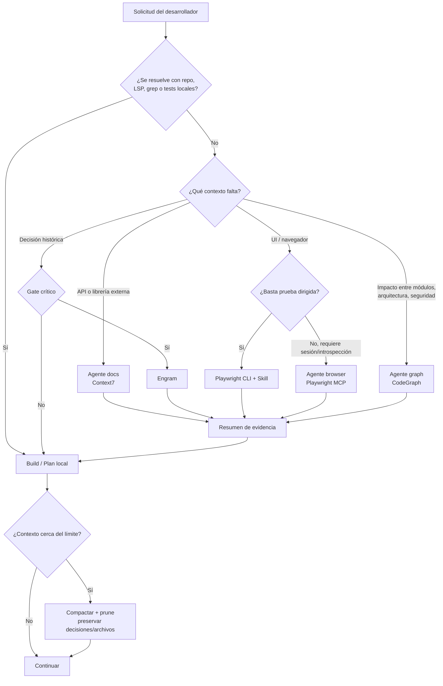
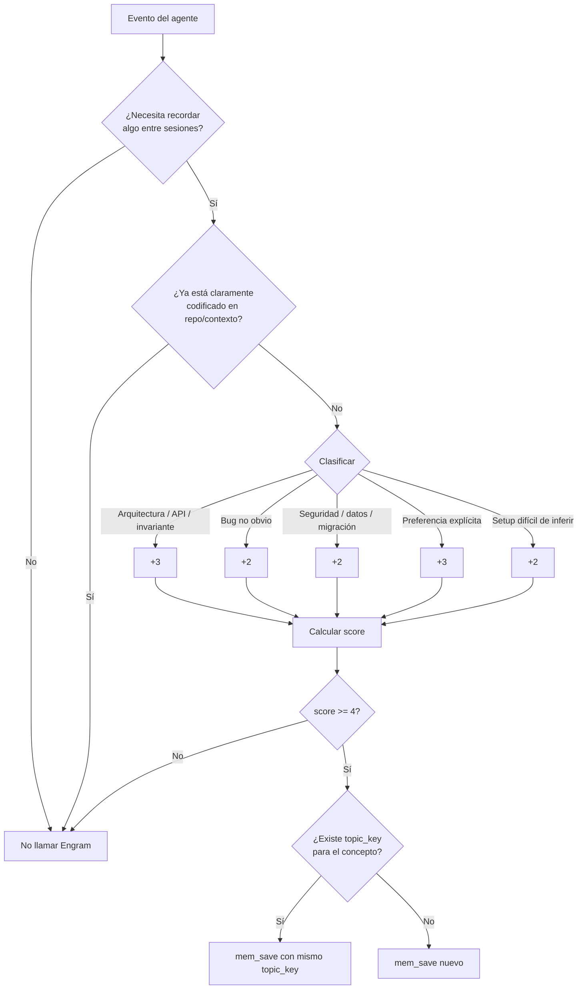
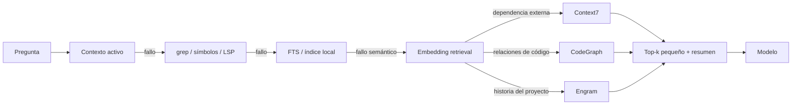

# Optimización de tokens y configuración de OpenCode v2 para desarrollo con Ponytail, Context7, Engram, Playwright y CodeGraph

## Resumen ejecutivo

Este informe se basa en la documentación oficial y repositorios primarios disponibles al **20 de septiembre de 2026**. Como no se especificó un patch exacto de OpenCode ni de los plugins, conviene tratar la configuración propuesta como objetivo para la línea actual de OpenCode y validarla contra el esquema oficial `opencode.json` de la versión instalada. OpenCode permite configurar modelos, un `small_model`, agentes especializados, temperatura, `top_p`, límites de pasos, compactación, permisos y MCP locales/remotos; además, las opciones adicionales del agente pueden transmitirse al proveedor del modelo. citeturn5view0turn6view0turn6view1turn25search26

La conclusión principal es que **el mayor ahorro no proviene de reducir agresivamente `max_tokens`, sino de reducir el contexto que el modelo recibe inútilmente**. OpenCode advierte expresamente que cada servidor MCP habilitado añade contexto y que una colección grande de herramientas puede incluso superar el límite de contexto; menciona específicamente GitHub MCP como ejemplo de un servidor que puede aportar muchos tokens. OpenCode permite deshabilitar MCP, herramientas completas o exponerlas solamente a agentes concretos. citeturn17view6turn17view1

Por ello, la arquitectura que recomiendo es:

| Componente | Política recomendada | Motivo principal |
|---|---|---|
| **Ponytail** | `lite` por defecto; `full` durante implementación/refactor; `off` para investigación pura | Ponytail inyecta reglas en **cada turno**, por lo que su coste es recurrente, no por llamada. citeturn19view0turn19view1 |
| **Context7** | Disponible, pero invocado solo cuando una API/dependencia externa no pueda resolverse con el código local | Tiene solamente un pequeño conjunto de herramientas y se puede saltar la resolución de biblioteca si se conserva el `libraryId`. citeturn0search3turn0search11 |
| **Engram** | Mantener el plugin por su recuperación de sesión/compactación, pero poner las herramientas de memoria detrás de una política de llamadas críticas | Engram usa almacenamiento local SQLite/FTS5, soporta contexto compacto y evita deliberadamente almacenar el “firehose” de tool calls. citeturn14view0turn15view3turn15view4 |
| **Playwright** | No exponer el MCP al agente general. Usar un agente `browser`, y preferir CLI+Skills para pruebas rutinarias | El propio proyecto Playwright indica que CLI+Skills es más eficiente en tokens para coding agents porque evita grandes schemas MCP y árboles de accesibilidad; MCP es mejor cuando se requiere estado persistente e introspección iterativa. citeturn16search3turn16search5 |
| **CodeGraph** | Agente `graph`/`review` únicamente; activarlo para impacto transversal, arquitectura, seguridad o repos grandes | Su adaptador OpenCode añade contexto respaldado por grafo, sesiones explícitas y evidencia acotada; no hace falta pagar ese contexto en cambios triviales. citeturn0search13 |
| **Compactación OpenCode** | `auto:true`, `prune:true`, reserva aproximada de 10–16k tokens | OpenCode puede compactar automáticamente y eliminar tool outputs antiguos; el ejemplo oficial utiliza una reserva de 10.000 tokens. citeturn5view1 |
| **Agentes especializados** | `build`, `docs`, `memory`, `browser`, `graph` | La exposición de herramientas por agente evita que cada conversación cargue todas las definiciones MCP. OpenCode recomienda precisamente esta estrategia cuando hay muchos MCP. citeturn17view1 |

Mi configuración equilibrada sería aproximadamente: **temperatura 0.15–0.25 para implementación, `top_p` 0.9–0.95, penalizaciones de frecuencia/presencia en cero salvo una razón específica del proveedor, 24–36 pasos máximos para `build`, compactación automática con pruning, y MCP de alto coste accesibles solamente mediante agentes especializados**. OpenCode documenta temperaturas bajas como apropiadas para trabajo analítico/predecible, `top_p` como control adicional de diversidad y `steps` como límite explícito de iteraciones del agente para controlar costes. citeturn6view0turn6view1

Un punto importante: **`max_tokens`, `frequency_penalty` y `presence_penalty` no deben tratarse como propiedades universales de OpenCode**. La interfaz genérica documenta `temperature`, `top_p`, `steps`, modelo, etc.; otras opciones pueden ser específicas del proveedor/modelo y OpenCode las transmite a este. Por tanto, el nombre exacto de un límite de salida —por ejemplo `max_tokens`, `maxOutputTokens` u otro— debe verificarse contra el proveedor elegido en lugar de copiar una configuración global que quizá sea ignorada. citeturn6view1turn25search26

La arquitectura objetivo es esta:



El principio es **local-first, retrieval-second, MCP especializado tercero**. MCP es un estándar para conectar aplicaciones de IA con datos, herramientas y workflows externos, pero no implica que todos los servidores deban estar cargados simultáneamente. citeturn24search28turn17view6


## Modelo de coste y arquitectura para reducir tokens

Antes de analizar cada plugin es importante separar cuatro costes distintos. Confundirlos conduce a configuraciones aparentemente “baratas” que siguen gastando muchos tokens.

**Impuesto de schema.** Cuando el agente ve un MCP, también necesita conocer sus herramientas y sus esquemas. OpenCode advierte que esa información se acumula en el contexto aun antes de que una herramienta produzca resultados. Por eso **10 MCP habilitados pero nunca llamados pueden ser más caros que 2 MCP llamados varias veces**. citeturn17view6

**Payload de la llamada.** El resultado de una consulta de documentación, un DOM, un grafo o una memoria entra posteriormente en el contexto del modelo. Ese coste depende mucho más del tamaño de la respuesta que del número nominal de llamadas.

**Persistencia.** Una salida grande permanece en la conversación hasta que sea descartada o compactada. OpenCode ofrece `compaction.auto`, `compaction.prune` y `compaction.reserved`; `prune` elimina outputs antiguos de herramientas para ahorrar tokens. citeturn5view1

**Inferencia adicional.** Una herramienta local no necesariamente ejecuta otro LLM. Engram, por ejemplo, mantiene su memoria principal en SQLite con FTS5 y fue diseñado para evitar guardar indiscriminadamente tool calls; ciertas operaciones semánticas sí pueden utilizar un agente externo cuando se configura `ENGRAM_AGENT_CLI`. citeturn14view0turn15view4

Las siguientes cifras son **presupuestos de ingeniería propuestos en este informe, no métricas publicadas por los proveedores**. Se refieren aproximadamente al material que una llamada puede terminar haciendo visible al modelo, no a tokens facturados internamente por cada servidor.

| Componente / operación | Coste visible estimado | Riesgo principal |
|---|---:|---|
| Ponytail `lite` | ~0.2–0.5k **por turno**, no por llamada | Se repite porque el plugin inyecta las reglas en cada turno. citeturn19view1 |
| Ponytail `full/ultra` | ~0.5–1.5k por turno | Coste recurrente aunque no se use ninguna herramienta |
| Context7 resolver biblioteca | ~0.1–0.5k | Llamada evitable si ya conocemos el `libraryId`. citeturn0search3turn0search11 |
| Context7 query docs | ~0.8–4k | Query demasiado genérica devuelve más documentación |
| Engram `mem_save` | ~0.1–0.4k | Guardar trivialidades genera futuras recuperaciones ruidosas |
| Engram `mem_search` | ~0.3–1.5k | `limit` excesivo |
| Engram `mem_context` compacto | ~0.5–2k recomendado | Pedir contexto completo innecesariamente |
| Engram contexto sin acotar | Puede ser muy alto | La API admite `max_bytes` hasta 65.536 bytes; `compact=true` elimina previews. citeturn14view0 |
| Playwright `browser_find` | ~0.2–1k | Bajo: devuelve coincidencias y contexto alrededor, no todo el árbol. citeturn17view3turn16search7 |
| Playwright acción + snapshot | ~0.7–5k | DOM/accesibilidad complejo |
| Playwright snapshot completo | ~3–15k+ | Uno de los mayores productores de contexto |
| CodeGraph query acotada | ~0.5–3k | Alcance excesivamente amplio |
| CodeGraph review/impacto amplio | ~2–10k | Evidencia transversal de muchos símbolos/archivos |
| GitHub MCP completo | potencialmente alto | OpenCode lo menciona como MCP capaz de consumir mucho contexto. citeturn17view6 |

La métrica que recomiendo controlar no es simplemente `calls_per_turn`, sino:

\[
\text{Coste efectivo} =
\text{schemas activos}+
\sum \text{payloads retornados}+
\text{repetición de instrucciones}+
\text{contexto obsoleto retenido}
\]

Esto explica por qué limitar Engram a una llamada menos puede ahorrar menos que dejar de enviar un snapshot completo de Playwright o sacar un MCP de 50 herramientas del agente general.

La estrategia de exposición debería ser:

```text
Agente build
  repo + shell + LSP + tests
  Ponytail lite/full
  sin Playwright
  sin GitHub completo
  Engram write: gate crítico
  Context7: solo fallback

Agente docs
  Context7
  repo read-only
  sin browser
  sin Engram write

Agente browser
  Playwright MCP
  repo read-only
  sin CodeGraph salvo incidente complejo

Agente graph
  CodeGraph
  repo read-only
  sin Playwright
  Context7 solo si necesita interpretar una dependencia

Agente memory
  Engram
  mínima cantidad posible de contexto local
```

OpenCode soporta esta filosofía directamente: sus MCP pueden deshabilitarse, sus herramientas pueden bloquearse por patrón y la documentación recomienda desactivar globalmente un MCP cuando solo un agente especializado debe verlo. El sistema de permisos actual utiliza `allow`, `ask` y `deny`; el antiguo bloque booleano `tools` permanece por compatibilidad pero está deprecado. citeturn17view1turn25search6turn5view3


## Análisis de Ponytail, Context7, Engram, Playwright y CodeGraph

| Componente | Función y cuándo usarlo | Parámetros / estado | Caché, batching y throttling | Estrategia de tokens |
|---|---|---|---|---|
| **Ponytail** | Reglas para evitar sobreingeniería: comprobar YAGNI, reutilizar código existente, stdlib, plataforma nativa, dependencias ya instaladas y finalmente implementar lo mínimo necesario. El README enfatiza que la reducción de tokens es un efecto secundario y no debe eliminar validación, seguridad o accesibilidad. citeturn19view0 | Modos `lite`, `full`, `ultra`, `off`; `PONYTAIL_DEFAULT_MODE` o `defaultMode`. En OpenCode el plugin se instala con `@dietrichgebert/ponytail` e inyecta el ruleset cada turno. citeturn19view0turn19view1 | No hay batching de llamadas porque no es un MCP de consulta. Persiste el modo activo. | `lite` cotidiano; `full` al implementar; `ultra` excepcional; `off` para research/read-only. El coste a optimizar es **prompt fijo/turno**. |
| **Context7** | Recupera documentación actual y específica de versión. Tiene resolución de library ID y consulta documental; si ya se conoce el ID puede omitirse la resolución. citeturn0search3turn0search11 | `libraryName`, `query`, `libraryId`; API key opcional/recomendada para mayores límites. El plugin oficial de OpenCode añade las herramientas y una skill. citeturn0search3turn16search0 | No encontré en la documentación primaria revisada un control MCP público equivalente a `max_tokens` o TTL por consulta. Conviene implementar caché local de `(library, version)->libraryId` y deduplicación de queries. | Pregunta específica + versión + API concreta. Nunca “dame toda la documentación de React”. |
| **Engram** | Memoria persistente local para decisiones, bugs, descubrimientos, configuración y sesiones. SQLite+FTS5 es la fuente local autoritativa; la nube es opcional. citeturn14view0 | `mem_context` admite `compact`, `max_bytes` y conteos por sección; conflict scanning expone `concurrency`, `timeout_per_call_seconds`, `max_semantic`, etc. citeturn14view0 | Deduplicación exacta por hash en `mem_save`; `topic_key` permite actualizar un conocimiento existente en vez de crear copias. Contexto máximo está acotado y puede compactarse. citeturn15view2 | El mejor MCP para imponer una política explícita de “solo conocimiento durable”; evitar buscar/guardar en cada turno. |
| **Playwright MCP** | Navegación, UI, browser automation e introspección mediante snapshots estructurados del árbol de accesibilidad, sin depender de visión. citeturn16search3 | Herramientas como navegación, evaluación, búsqueda, formularios y snapshots; `browser_fill_form` agrupa varios campos. `browser_find` busca dentro del snapshot devolviendo solo coincidencias cercanas. citeturn17view3 | El estado persistente del navegador evita repetir autenticación/navegación, pero no equivale a caché de tokens. Las versiones recientes han reducido snapshots y añadido `browser_find` expresamente como alternativa más barata al snapshot completo. citeturn16search7 | CLI+Skills para pruebas rutinarias; MCP solo para loops largos, exploración, self-healing o estado persistente. citeturn16search5 |
| **CodeGraph** | Proporciona contexto estructural respaldado por grafo para navegación, impacto, review, arquitectura y workflows. Su adaptador OpenCode enriquece intenciones relacionadas con archivos/edición usando evidencia acotada. citeturn0search13 | `CODEGRAPH_API_URL`, `CODEGRAPH_PROJECT`, servidor MCP/LSP, sesión del proyecto; documenta modos full, sync-pending y graph-only según disponibilidad del índice. citeturn0search13 | El grafo ya funciona como índice reutilizable; el adaptador conserva un estado ligero de reanudación mientras el servidor mantiene la sesión autoritativa. citeturn0search13 | Reservarlo para queries cuya respuesta realmente requiera relaciones entre símbolos/módulos; no usarlo para abrir un archivo conocido o corregir una línea. |

**Ponytail merece una distinción especial.** Su benchmark oficial reporta una reducción media de aproximadamente 22% de tokens en su escenario agentic concreto, junto con menos código, coste y tiempo, pero el propio proyecto advierte que la regla no es “usar el mínimo de tokens” y que modelos de razonamiento pueden incluso gastar más deliberando sobre la jerarquía de simplificación. Es un benchmark del proyecto, no una garantía transferible a otro modelo o codebase. citeturn19view0

La configuración práctica es extremadamente simple:

```jsonc
{
  "plugin": [
    "@dietrichgebert/ponytail"
  ]
}
```

Y fuera de OpenCode:

```bash
export PONYTAIL_DEFAULT_MODE=lite
```

Uso recomendado durante una sesión:

```text
/ponytail lite     # rutina / pequeños fixes
/ponytail full     # feature o refactor real
/ponytail off      # investigación que no va a escribir código
/ponytail ultra    # auditoría excepcional de sobreingeniería
```

Ponytail documenta `full` como default; para un objetivo explícitamente orientado a tokens cambiaría ese default a `lite`, porque OpenCode recibe el ruleset en cada turno. citeturn19view0turn19view1

**Context7 debe comportarse como cache miss de conocimiento externo, no como buscador automático de cada pregunta.** Su integración OpenCode oficial puede instalarse como plugin, añade `context7_resolve-library-id` y `context7_query-docs`, y recomienda especificar claramente la versión y el tema. Si conocemos el library ID se puede ir directamente a la segunda operación. citeturn0search3turn0search11

```jsonc
{
  "plugin": [
    "@upstash/context7-opencode"
  ]
}
```

Pseudocódigo eficiente:

```python
def external_docs(library, version, question):
    key = f"{library}@{version}"

    library_id = cache.get(key)

    if library_id is None:
        library_id = context7.resolve_library_id(
            libraryName=library,
            query=f"{library} {version}: {question}"
        )
        cache.put(key, library_id, ttl_days=7)

    query_key = hash(library_id, normalize(question))

    if cache.has_fresh(query_key):
        return cache.get(query_key)

    result = context7.query_docs(
        libraryId=library_id,
        query=make_narrow_query(question, version)
    )

    cache.put(query_key, result, ttl_hours=12)
    return summarize(result, target_tokens=900)
```

El TTL anterior es una política propuesta, no una característica nativa de Context7. La optimización importante que sí documenta Context7 es evitar la fase de resolución cuando el `libraryId` ya es conocido. citeturn0search3turn0search11

**Engram es esencialmente lo contrario a Context7:** no resuelve documentación pública, sino conocimiento duradero de tu proyecto. Su setup recomendado para OpenCode instala un plugin, registra el MCP con el perfil orientado a agentes y añade gestión de sesiones/recuperación de compactación. La documentación actual del repositorio presenta conteos de herramientas ligeramente distintos entre páginas —una sección habla de 19 herramientas agent-facing mientras otra tabla todavía muestra 18—, por lo que no conviene codificar una expectativa sobre el número; sí conviene usar `--tools=agent` y verificar lo expuesto tras actualizar. citeturn20view3turn20view7

```bash
engram setup opencode
```

La configuración equivalente del MCP es conceptualmente:

```jsonc
{
  "mcp": {
    "engram": {
      "type": "local",
      "command": ["engram", "mcp", "--tools=agent"],
      "enabled": true
    }
  }
}
```

El plugin OpenCode de Engram añade mucho valor sobre el MCP desnudo: inicia el servidor, resuelve la identidad de proyecto, importa memoria sincronizada si existe, crea sesiones, inyecta el Memory Protocol y participa en la recuperación después de compactación. Deliberadamente **no registra todos los tool calls en bruto**. citeturn20view6turn20view8

**Playwright es donde se puede producir una de las mayores reducciones.** Microsoft declara actualmente que para coding agents el flujo CLI+Skills suele ser más eficiente que MCP porque evita cargar grandes tool schemas y árboles de accesibilidad; el MCP sigue siendo preferible para workflows que necesitan estado persistente, introspección rica o múltiples pasos autónomos. citeturn16search3turn16search5

Cuando MCP sí sea necesario:

```jsonc
{
  "mcp": {
    "playwright": {
      "type": "local",
      "command": ["npx", "-y", "@playwright/mcp@latest"],
      "enabled": true,
      "timeout": 5000
    }
  }
}
```

OpenCode soporta MCP locales mediante un array de comando, `environment`, `enabled` y un timeout de descubrimiento de herramientas; el valor documentado por defecto para ese timeout es 5 segundos. citeturn17view0turn17view6

Dentro del loop del navegador:

```python
# Malo
snapshot = browser_snapshot()          # árbol entero
target = llm_search(snapshot, "Login")

# Mejor
matches = browser_find("Login|Sign in")
if len(matches) == 1:
    browser_click(matches[0].ref)
else:
    snapshot = browser_snapshot()      # fallback, no primera opción
```

`browser_find` fue añadido precisamente para localizar nodos con algunas líneas de contexto en vez de capturar todo el snapshot y la documentación lo describe como más barato. Las versiones recientes también redujeron el ruido de los snapshots. citeturn17view3turn16search7

Para formularios:

```python
browser_fill_form([
    {"name": "email", "value": email},
    {"name": "password", "value": password},
    {"name": "rememberMe", "value": True},
])
```

Playwright expone `browser_fill_form` para múltiples campos en una sola acción, evitando una secuencia separada para cada input. citeturn17view3

**CodeGraph aporta valor cuando la unidad de razonamiento deja de ser “archivo” y pasa a ser “sistema”.** Su plugin OpenCode añade contexto de proyecto, comandos guiados, herramientas de sesión/contexto, reviews y hooks que enriquecen mensajes relacionados con archivos o workflows usando evidencia acotada. El catálogo completo documentado para la revisión descrita por CodeGraph es muy amplio, por lo que exponer toda esa superficie indiscriminadamente al agente general es justamente el patrón que debemos evitar. citeturn0search13

```jsonc
{
  "plugin": [
    "opencode-codegraph"
  ]
}
```

Entorno:

```bash
export CODEGRAPH_API_URL="http://127.0.0.1:8000"
export CODEGRAPH_PROJECT="mi-proyecto"
```

Pseudocódigo de decisión:

```python
def need_codegraph(task):
    return any([
        task.cross_module_impact,
        task.architecture_question,
        task.security_dataflow,
        task.large_refactor,
        task.unknown_call_graph,
        task.review_requires_transitive_impact,
    ])

if need_codegraph(task):
    evidence = codegraph.query(
        project=PROJECT,
        scope=changed_symbols,
        max_depth=2,
    )
    working_context.add(summarize(evidence))
else:
    # grep/LSP/local source is cheaper
    inspect_locally(task)
```

La interfaz de CodeGraph también enfatiza scopes explícitos del proyecto y revisiones acotadas; su CLI recomienda no confiar en scopes implícitos para acciones específicas de proyecto. citeturn21search0


## Política de Engram para llamadas exclusivamente críticas

La política oficial de memoria de Engram considera memorables, entre otras cosas, una corrección de bug, una decisión de arquitectura/diseño, un descubrimiento no obvio, configuración de entorno, patrones y preferencias del usuario. También recomienda usar `topic_key` para un tema que evoluciona en vez de crear observaciones duplicadas. citeturn15view1turn15view2

Para un sistema optimizado, yo **no interpretaría “bug fix” como “cada cambio de una línea debe guardarse”**. Definiría “crítico” como conocimiento que satisface al menos una de estas propiedades:

| Señal | Peso propuesto |
|---|---:|
| Será necesario en otra sesión o después de una compactación | +3 |
| Es una decisión arquitectónica, contrato/API o invariante | +3 |
| La causa del bug fue no obvia y sería costoso redescubrirla | +2 |
| Afecta seguridad, pérdida de datos, migraciones o compatibilidad | +2 |
| Resolverlo exigió evidencia repartida en varios archivos/sistemas | +2 |
| El usuario dijo explícitamente “recuerda esto” o estableció una preferencia persistente | +3 |
| Configuración de entorno difícil de inferir del repositorio | +2 |
| El dato ya está claramente codificado/documentado en el repo | −2 |
| Es un resultado temporal de test/log/build | −3 |
| Es información disponible en el contexto activo y sin valor futuro | −2 |

Política sugerida:

\[
\text{guardar si score} \ge 4
\]

\[
\text{buscar memoria si score de necesidad histórica} \ge 3
\]

\[
\text{mem\_context completo solamente tras reset/compactación o recuperación excepcional}
\]

Esto produce el siguiente gate:



Para **lecturas**, usaría un gate todavía más estricto:

```python
def should_read_engram(task, state):
    if task.explicitly_refers_to_previous_decision:
        return True

    if task.requires_project_history and not state.current_context_has_answer:
        return True

    if state.just_compacted and state.summary_is_insufficient:
        return True

    if task.failure_repeats and local_search_attempts >= 2:
        return True

    return False
```

Y para **escrituras**:

```python
def should_save_engram(event):
    score = 0

    score += 3 if event.cross_session_value else 0
    score += 3 if event.architecture_or_contract else 0
    score += 2 if event.non_obvious_root_cause else 0
    score += 2 if event.security_or_data_risk else 0
    score += 2 if event.expensive_to_rediscover else 0
    score += 3 if event.explicit_user_memory else 0

    score -= 2 if event.already_documented_in_repo else 0
    score -= 3 if event.ephemeral_tool_output else 0
    score -= 2 if event.only_useful_in_current_turn else 0

    return score >= 4
```

Los ejemplos quedarían así:

| Evento | Engram | Razón |
|---|---|---|
| “Corregí typo en README” | No | Repositorio ya conserva el dato |
| “ESLint falló y luego pasó” | No | Estado efímero |
| “Esta API exige header `X` porque el gateway elimina `Authorization`” | Sí | Configuración no obvia, alto coste de redescubrimiento |
| “Elegimos outbox en vez de dual-write por atomicidad” | Sí | Decisión arquitectónica |
| “El test falla solo en UTC−5 por una conversión local→UTC” | Sí | Bug no obvio |
| “Renombré `foo` a `bar`” | Normalmente no | Git conserva el cambio |
| “El usuario exige siempre migrations backwards-compatible” | Sí | Preferencia/regla persistente |
| “Acabo de leer package.json y React es v19” | No | El repo es la fuente de verdad |
| “Se compactará la sesión tras un refactor de 20 archivos” | Sí: resumen | Engram está diseñado para recuperación post-compactación. citeturn15view3turn20view8 |

Para `mem_context` recomendaría este patrón conceptual:

```python
ctx = engram.mem_context(
    project=PROJECT,
    compact=True,
    max_bytes=8192,
    observations=6,
    prompts=0,
    sessions=2,
    pinned=4,
)
```

Los nombres concretos y conteos deben verificarse contra la versión instalada, pero `compact`, `max_bytes` y los límites por sección son capacidades documentadas. `compact=true` elimina previews y un `max_bytes` positivo limita el contexto completo; el servidor lo acota como máximo a 65.536 bytes. citeturn14view0

Para writes:

```python
engram.mem_save(
    title="Auth: refresh tokens rotan en cada uso",
    type="decision",
    topic_key="auth/refresh-token-rotation",
    content="""
What: refresh tokens se rotan en cada refresh.
Why: limita replay de tokens filtrados.
Where: auth/refresh/*
Learned: actualizar el mismo topic_key si cambia la política.
"""
)
```

`mem_save` ya contiene deduplicación de contenido exacto y `topic_key` actúa como upsert/revisión del conocimiento, así que no conviene construir otro sistema paralelo de deduplicación semántica para las escrituras normales. citeturn15view2

Mi throttling recomendado por tarea sería:

| Escenario | `mem_search` | `mem_context` | `mem_save` | `mem_session_summary` |
|---|---:|---:|---:|---:|
| Cambio trivial | 0 | 0 | 0 | 0 |
| Bug normal | ≤1 | 0 | 0–1 | 0 |
| Feature mediana | ≤2 | ≤1 | ≤2 | al compactar/cerrar si fue importante |
| Refactor grande | ≤3 | ≤1 | ≤3 | sí |
| Recuperación post-compaction | primero resumen disponible; `mem_context` solo si falta información | ≤1 | solo nueva evidencia | 1 |

Esto es deliberadamente más conservador que “buscar memoria en cada prompt”. Engram documenta que, tras compactación, el flujo debería persistir primero el resumen y pedir `mem_context` únicamente cuando haga falta contexto adicional. citeturn20view4turn15view3

Para reforzarlo desde OpenCode, use permisos:

```jsonc
{
  "permission": {
    "engram_mem_*": "ask"
  }
}
```

Y en un agente especializado:

```jsonc
{
  "agent": {
    "memory": {
      "permission": {
        "engram_mem_*": "allow"
      }
    }
  }
}
```

El nombre exacto del tool debe comprobarse tras la instalación; la propia guía de Engram indica verificar en una sesión nueva la presencia de herramientas `engram_mem_*`. OpenCode admite reglas por herramienta MCP y wildcards con `allow`, `ask` o `deny`. citeturn20view3turn5view3turn25search6

Una optimización todavía mejor es **no pedir aprobación humana para cada memoria crítica**, sino hacer que `build` solo invoque un subagente `memory` cuando el score anterior supera el umbral. Así el agente principal no necesita la totalidad de las herramientas Engram durante cada turno.


## Configuración recomendada de OpenCode

La siguiente es una configuración de referencia **equilibrada**. Los nombres del modelo se dejan como placeholders porque el usuario no indicó proveedor; OpenCode soporta numerosos proveedores a través de AI SDK/Models.dev y permite definir tanto un modelo principal como un `small_model`. citeturn5view0turn25search26

```jsonc
{
  "$schema": "https://opencode.ai/config.json",

  "model": "PROVIDER/MAIN_CODING_MODEL",
  "small_model": "PROVIDER/SMALL_FAST_MODEL",

  "compaction": {
    "auto": true,
    "prune": true,
    "reserved": 12000
  },

  "plugin": [
    "@dietrichgebert/ponytail",
    "@upstash/context7-opencode"
    // Instalar "opencode-codegraph" solo en proyectos que lo justifiquen.
  ],

  "mcp": {
    "engram": {
      "type": "local",
      "command": ["engram", "mcp", "--tools=agent"],
      "enabled": true,
      "timeout": 5000
    },

    "playwright": {
      "type": "local",
      "command": ["npx", "-y", "@playwright/mcp@latest"],
      "enabled": true,
      "timeout": 5000
    }
  },

  "permission": {
    "playwright_*": "deny",
    "engram_mem_*": "ask"
  },

  "agent": {
    "build": {
      "temperature": 0.2,
      "top_p": 0.9,
      "steps": 32,

      "permission": {
        "playwright_*": "deny"
      }
    },

    "docs": {
      "temperature": 0.1,
      "top_p": 0.9,
      "steps": 12,

      "permission": {
        "playwright_*": "deny",
        "engram_mem_*": "deny"
      }
    },

    "memory": {
      "temperature": 0.1,
      "top_p": 0.85,
      "steps": 8,

      "permission": {
        "engram_mem_*": "allow",
        "playwright_*": "deny"
      }
    },

    "browser": {
      "temperature": 0.1,
      "top_p": 0.9,
      "steps": 20,

      "permission": {
        "playwright_*": "allow",
        "engram_mem_*": "deny"
      }
    },

    "graph": {
      "temperature": 0.1,
      "top_p": 0.9,
      "steps": 16,

      "permission": {
        "playwright_*": "deny"
      }
    }
  }
}
```

La estructura de `model`, `small_model`, agentes, temperatura, `top_p` y `steps` está respaldada por la configuración oficial. Los patrones concretos de nombre de herramientas MCP deben revisarse mediante las herramientas de inspección de la instalación porque dependen del servidor/plugin y versión. citeturn5view0turn6view0turn6view1turn20view3

**Temperatura.** OpenCode documenta aproximadamente 0–0.2 para comportamiento enfocado/analítico, 0.3–0.5 para un equilibrio más general y valores superiores para tareas creativas. Para programación determinista usaría `0.1–0.2`; planificación abierta puede subir a `0.25–0.35`, pero no hay ventaja clara en hacer que un agente de tests o memoria sea creativo. citeturn6view0

| Agente | Temperatura recomendada |
|---|---:|
| `memory` | 0.0–0.15 |
| `browser` | 0.05–0.15 |
| `review` / `graph` | 0.05–0.2 |
| `build` | 0.15–0.25 |
| `plan` | 0.15–0.35 |
| brainstorming UX/arquitectura | 0.35–0.5 |

**`top_p`.** OpenCode permite 0–1, con valores bajos más concentrados y altos más diversos. Recomiendo dejarlo relativamente alto, aproximadamente `0.9`, y utilizar temperatura como control principal; ajustar simultáneamente temperatura y `top_p` a valores muy restrictivos suele aportar poca utilidad operativa para código. citeturn6view1

**Frecuencia y presencia.** En programación recomiendo **0/neutral** por defecto. Código correcto necesita repetir identificadores, nombres de tipos y patrones, por lo que penalizar repetición puede ser contraproducente. Además, OpenCode no documenta estos dos parámetros como controles universales del agente; opciones adicionales son transmitidas al proveedor y deben comprobarse contra el modelo concreto. citeturn6view1

**`max_tokens` / salida máxima.** No fijaría un gigantesco máximo global. Más importante aún, no usaría literalmente `max_tokens` en la configuración sin verificar el proveedor. Como política lógica:

| Tipo de trabajo | Presupuesto de salida recomendado |
|---|---:|
| Pregunta / fix pequeño | 2–4k |
| Feature normal | 4–8k |
| Plan/refactor amplio | 8–12k |
| Generación excepcional de artefactos grandes | 12–16k+ |

Estos son presupuestos recomendados, no límites propios de OpenCode. La capacidad real y el nombre del parámetro dependen del proveedor/modelo; OpenCode permite opciones adicionales específicas del proveedor. citeturn6view1

**Ventana de contexto.** No recomendaría configurar una cifra ficticia global. La ventana depende del modelo seleccionado y OpenCode obtiene información de modelos mediante AI SDK/Models.dev. La capa que sí debe controlar es cuánto de esa ventana dejamos disponible: `compaction.reserved`, pruning de tool outputs, agentes especializados y retrieval limitado. citeturn25search26turn5view1

Para un modelo con contexto \(C\), una política conservadora sería:

\[
\text{working set máximo} \approx 0.70C
\]

\[
\text{reserva de salida/razonamiento} \approx 0.15C
\]

\[
\text{margen de compactación/herramientas} \approx 0.15C
\]

No son porcentajes impuestos por OpenCode, sino un envelope operativo propuesto. En configuraciones reales el `reserved` absoluto debe adaptarse al contexto del modelo. El ejemplo oficial de OpenCode utiliza `reserved: 10000`. citeturn5view1

**Compactación.** Aquí sí cambiaría el default útil para programación intensiva:

```jsonc
{
  "compaction": {
    "auto": true,
    "prune": true,
    "reserved": 12000
  }
}
```

`auto` compacta cuando el contexto se llena; `prune` elimina tool outputs antiguos; `reserved` mantiene un margen. citeturn5view1

Además, OpenCode proporciona un hook específico antes de generar el resumen de continuación. Es un lugar excelente para conservar exclusivamente estado de alto valor: tarea actual, decisiones y archivos activos. citeturn17view9

```ts
export const TokenAwareCompaction = async () => ({
  "experimental.session.compacting": async (_input, output) => {
    output.context.push(`
Keep only:
- current objective and acceptance criteria
- unresolved failures
- architectural decisions
- active files/symbols
- tests already executed and final status
- IDs of durable Engram memories

Drop:
- raw tool output
- successful intermediate commands
- duplicated code excerpts
- obsolete hypotheses
- verbose browser snapshots
`)
  }
})
```

**Retención de estado.** OpenCode guarda datos de sesión localmente y tiene agentes internos de compactación/resumen; Engram añade la capa de conocimiento persistente entre sesiones y una recuperación específica alrededor de compactación. Por ello, no mantendría “todo” en el chat: el chat conserva el working set, Engram conserva decisiones durables y Git conserva el estado del código. citeturn25search14turn25search38turn20view6

Una segmentación ideal sería:

```text
Chat actual
├── requerimiento activo
├── archivos/símbolos activos
├── errores aún no resueltos
└── últimos resultados de tests

AGENTS.md
├── convenciones realmente globales
├── comandos del proyecto
└── reglas estables de arquitectura

Engram
├── decisiones históricas
├── bugs no obvios
├── setup difícil de deducir
└── preferencias persistentes

Git
└── implementación y evolución del código

Context7
└── conocimiento externo/versionado, recuperado on demand

CodeGraph
└── relaciones estructurales recuperadas on demand
```

`AGENTS.md` forma parte del contexto de OpenCode, por lo que también debe mantenerse corto; OpenCode lo utiliza para estructura, patrones e instrucciones del proyecto. citeturn3view0turn25search34

Igualmente, las `references` con descripción son anunciadas al agente en su contexto. Si se crean decenas de referencias globales con descripciones largas, se introduce otra fuente permanente de tokens; reserve descripciones para referencias que realmente beneficien el descubrimiento automático. citeturn25search2

Finalmente, active la caché del proveedor cuando sea pertinente. OpenCode documenta una opción de proveedor `setCacheKey` para garantizar la presencia de una clave de caché, además de timeouts de proveedor. Su efecto económico exacto depende del proveedor seleccionado. citeturn5view0

Conceptualmente:

```jsonc
{
  "provider": {
    "YOUR_PROVIDER": {
      "options": {
        "setCacheKey": true
      }
    }
  }
}
```

La regla de diseño es mantener estable el prefijo cacheable —instrucciones, AGENTS, schemas realmente necesarios— y colocar información volátil al final, en vez de modificar todo el system prompt en cada turno.


## Patrones prácticos para caching, resumen, chunking, embeddings y retrieval

La optimización más efectiva para programación es construir una **jerarquía de retrieval**, en lugar de volcar todo el repositorio o todas las herramientas dentro del contexto:



OpenCode ya ofrece soporte LSP y agentes especializados, mientras Engram eligió deliberadamente SQLite+FTS5 en lugar de convertir cada memoria en una búsqueda vectorial; su documentación afirma que FTS5 cubre la mayoría de sus necesidades y evita el almacenamiento indiscriminado. citeturn2view0turn15view4

Por ello, para código usaría **retrieval lexical/symbol-first y embeddings-second**:

```python
def retrieve_code(query):
    # Etapa barata y precisa
    hits = symbols.search(query, limit=8)
    hits += grep.search(keywords(query), limit=12)

    ranked = dedupe_and_rank(hits)

    if confidence(ranked) >= 0.78:
        return select_top(ranked, k=4)

    # Fallback semántico solamente cuando lexical no alcanza
    vector_hits = embeddings.search(query, k=6)

    return rerank(
        lexical=ranked,
        semantic=vector_hits,
        final_k=4
    )
```

Los valores `0.78`, `k=4`, etc. son políticas iniciales propuestas y deben medirse con su codebase. El objetivo es que embeddings resuelvan ambigüedad, no que sustituyan una búsqueda exacta de símbolos.

Para **chunking**, evitaría chunks arbitrarios de miles de líneas. El código ya tiene unidades semánticas naturales:

```python
def chunk_source(file):
    for symbol in parser.top_level_symbols(file):
        chunk = source_for(symbol)

        if estimated_tokens(chunk) <= 1200:
            yield chunk
        else:
            yield header_and_signature(symbol)
            for child in symbol.children:
                yield bounded_chunk(child, max_tokens=900)
```

Política inicial recomendada:

| Contenido | Chunk objetivo | Overlap |
|---|---:|---:|
| Código | símbolo/clase; máximo ~800–1.200 tokens | 0–10% |
| Markdown/docs | ~800–1.200 tokens | 10–15% |
| Logs | agrupar por error/trace, no por tamaño fijo | 0 |
| Diffs | por archivo/hunk | 0 |
| Config | documento completo si <1k; sección si mayor | 0 |

Estos tamaños son heurísticas del informe. Para código, la ventaja de una segmentación por AST/símbolo es evitar duplicar grandes regiones solamente para mantener overlap textual.

El **cache** debería tener varias capas:

```python
class DevContextCache:
    # Muy estable
    library_ids = TTLCache(days=30)

    # Versionado por commit/hash, no por tiempo
    code_summaries = ContentAddressedCache()

    # Puede cambiar externamente
    external_docs = TTLCache(hours=12)

    # Útil dentro de una sesión
    mcp_results = LRUCache(max_items=64)

    def key_for_file(self, path):
        return sha256(read_bytes(path))

    def key_for_query(self, backend, query, revision):
        return sha256(f"{backend}:{revision}:{normalize(query)}")
```

Para archivos del repo es mejor invalidar por hash/commit que por un TTL arbitrario. Para Context7, un TTL tiene más sentido porque el conocimiento externo puede actualizarse independientemente de su checkout.

Una política general de llamadas:

```python
def call_tool(tool, args):
    key = semantic_cache_key(tool, args)

    if tool.is_read_only and cache.valid(key):
        return cache[key]

    budget.ensure_allowed(
        tool=tool,
        estimated_payload=estimate(tool, args)
    )

    result = tool.call(args)

    compacted = normalize_and_trim(result)

    if tool.is_read_only:
        cache[key] = compacted

    return compacted
```

El punto crítico es `normalize_and_trim`: **no es necesario conservar la salida cruda de una herramienta solo porque fue barata de obtener**.

Ejemplo:

```python
raw = playwright.browser_snapshot()

# NO
context.append(raw)

# SÍ
evidence = extract({
    "url": raw.url,
    "relevant_nodes": nodes_near_target(raw, "Checkout"),
    "errors": raw.console_errors,
    "forms": forms_needed_for_task(raw),
})
context.append(evidence)
del raw
```

Para Playwright, esto refuerza la estrategia que Microsoft ya está aplicando en el MCP: snapshots más destilados y `browser_find` para obtener solamente los nodos alrededor de una coincidencia. citeturn16search7turn17view3

El **resumen incremental** debería activarse por cambios de fase, no cada N mensajes:

```python
if phase_changed("analysis", "implementation"):
    state.analysis_summary = summarize(
        keep=[
            "root cause",
            "chosen solution",
            "rejected alternatives only if important",
            "files to edit",
        ],
        discard=[
            "raw search output",
            "dead hypotheses",
            "duplicate snippets",
        ],
    )

if phase_changed("implementation", "verification"):
    state.implementation_summary = summarize(
        keep=[
            "actual modifications",
            "remaining risks",
            "tests to execute",
        ]
    )
```

Para una sesión larga, el working context deseado sería algo como:

```text
SYSTEM / stable
  reglas mínimas
  agente y permisos

PROJECT
  AGENTS.md resumido
  2–5 archivos activos

TASK
  requerimiento
  criterios de aceptación
  plan actual

EVIDENCE
  solo top-k resultados relevantes

STATE
  cambios realizados
  tests pendientes
  errores activos
```

No:

```text
SYSTEM
+ 15 MCP completos
+ todo el repo
+ 30 resultados de docs
+ snapshots antiguos
+ logs completos
+ memorias históricas completas
+ cada salida de shell desde el inicio
```

OpenCode permite precisamente recortar tool outputs antiguos durante compactación, y sus hooks de compactación permiten conservar selectivamente información que el resumen genérico no debería perder. citeturn5view1turn17view9

Un **router MCP** sencillo puede combinar todo:

```python
def route(task, state):
    # 1. Fuente de verdad local primero.
    if local_repo_can_answer(task):
        return LOCAL

    # 2. Documentación externa.
    if task.references_external_library:
        if state.has_cached_versioned_docs(task.library):
            return CACHE
        return CONTEXT7

    # 3. Historia durable.
    if should_read_engram(task, state):
        return ENGRAM

    # 4. Browser.
    if task.requires_browser:
        if task.is_scriptable_test and not task.requires_persistent_introspection:
            return PLAYWRIGHT_CLI
        return PLAYWRIGHT_MCP

    # 5. Relaciones complejas del código.
    if need_codegraph(task):
        return CODEGRAPH

    return LOCAL
```

Y un budget manager:

```python
BUDGETS = {
    "low": {
        "external_payload_tokens": 8_000,
        "mcp_calls": 8,
        "browser_mcp_calls": 0,
        "engram_calls": 3,
    },
    "medium": {
        "external_payload_tokens": 20_000,
        "mcp_calls": 20,
        "browser_mcp_calls": 8,
        "engram_calls": 5,
    },
    "high": {
        "external_payload_tokens": 50_000,
        "mcp_calls": 40,
        "browser_mcp_calls": 20,
        "engram_calls": 10,
    },
}
```

Estos límites son deliberadamente de **contexto externo por tarea**, no de tokens totales del modelo. Un refactor puede legítimamente necesitar mucho razonamiento y código sin que eso justifique 50 snapshots de navegador o 20 recuperaciones de memoria.


## MCP adicionales y perfiles de presupuesto recomendados

No añadiría MCP solo porque exista un servidor. Cada nuevo servidor debe superar este test:

\[
\text{valor de información esperado}
>
\text{schema permanente}+
\text{payload probable}+
\text{riesgo de llamadas innecesarias}
\]

OpenCode hace la misma advertencia en términos prácticos: muchos MCP incrementan rápidamente el contexto. citeturn17view6

Los adicionales de mayor utilidad serían estos:

| MCP / infraestructura | Ventaja | Caso ideal | Coste estimado | Compatibilidad / control |
|---|---|---|---:|---|
| **GitHub MCP oficial** | Repos, issues, PR, Actions y otras funciones GitHub sin construir integración propia | Revisar PR, leer issue, inspeccionar CI, abrir PR | Medio–muy alto si se expone completo | El servidor oficial permite allowlist de **toolsets** con `--toolsets`/`GITHUB_TOOLSETS` y herramientas individuales con `--tools`/`GITHUB_TOOLS`. citeturn24search2 |
| **Chrome DevTools MCP** | DevTools real: consola, red, debugging y performance tracing | Performance, network bugs y problemas que Playwright no explica bien | Medio–alto | MCP estándar; Google describe soporte para tracing de performance y control/inspección de Chrome. citeturn24search1turn24search5 |
| **Docker MCP Toolkit / Gateway** | Centraliza MCP en perfiles y evita gestionar individualmente cada runtime | Equipos con muchos MCP/proyectos | Bajo para gateway; depende de servidores detrás | Docker ofrece perfiles, gateway y Dynamic MCP para descubrir/agregar servidores durante una conversación. citeturn24search11turn24search3turn24search39 |
| **Playwright CLI + Skills** *(alternativa, no MCP adicional)* | Menos tool schema y menos snapshots en el contexto | E2E rutinario de coding agents | Bajo | El propio proyecto Playwright lo recomienda frente al MCP para throughput y eficiencia de tokens. citeturn16search5 |

El **GitHub MCP** merece exactamente el mismo tratamiento que Playwright: no cargarlo completo. El servidor oficial permite algo como:

```bash
GITHUB_TOOLSETS="repos,pull_requests" github-mcp-server
```

o incluso:

```bash
github-mcp-server \
  --tools get_file_contents,issue_read,create_pull_request
```

Estas opciones están documentadas oficialmente y son especialmente importantes porque OpenCode señala explícitamente al GitHub MCP como un caso que puede consumir muchos tokens de contexto. citeturn24search2turn17view6

Una configuración local conceptual para OpenCode:

```jsonc
{
  "mcp": {
    "github": {
      "type": "local",
      "command": [
        "github-mcp-server",
        "--toolsets",
        "repos,pull_requests"
      ],
      "enabled": true
    }
  }
}
```

Para frontend, **Chrome DevTools MCP no sustituye automáticamente a Playwright**. Playwright es mejor para automatización y testing determinista; Chrome DevTools resulta especialmente atractivo cuando la pregunta es “¿qué está pasando realmente en el navegador?” —trazas, performance, network/debug. Google documenta un flujo en que `performance_start_trace` graba una traza que el agente puede analizar. citeturn24search5

No habilitaría ambos al agente general:

```text
browser-test agent  -> Playwright
browser-perf agent  -> Chrome DevTools

Nunca:
build agent -> Playwright + Chrome DevTools + GitHub + CodeGraph + ...
```

Docker MCP Toolkit es interesante cuando la instalación crece porque organiza servidores en **perfiles** y el Gateway presenta esos servidores a los clientes. Dynamic MCP añade herramientas de descubrimiento como `mcp-find` y `mcp-add`, de modo que una organización con muchos servidores puede aproximarse a “descubrir bajo demanda” en vez de configurar cada backend indiscriminadamente en todos los proyectos. citeturn24search11turn24search39

Los tres perfiles de presupuesto quedarían así:

| Aspecto | Bajo | Medio — recomendado | Alto |
|---|---|---|---|
| Ponytail | `lite` | `lite`, `full` durante build | `full`, `ultra` solo auditoría |
| Context7 | Solo dudas bloqueantes; ≤2 queries/tarea | ≤4 queries/tarea + cache ID | ≤8, siempre con dedup |
| Engram | ≤3 calls; solo score ≥5 | ≤5 calls; score ≥4 | ≤10, pero sin raw logging |
| `mem_context` | `compact`, ~4–8 KB | `compact`, ~8–12 KB | `compact`, ≤16–24 KB salvo recuperación |
| Playwright | CLI+Skills | MCP solo agente `browser` | MCP persistente para flujos complejos |
| CodeGraph | Off salvo repo muy grande | Agente específico | Disponible a plan/review/graph |
| GitHub MCP | Off o 2–3 tools | Toolsets limitados | Más toolsets, nunca todo sin razón |
| `build.steps` | 20–24 | 28–36 | 40–64 |
| Compaction | auto + prune | auto + prune | auto + prune |
| Reserva | ~8–10k | ~10–16k | ~16–24k según modelo |
| Tool payload externo | ~8k tokens/tarea | ~20k | ~50k |
| Filosofía | aggressively local-first | equilibrio | máxima capacidad con aislamiento |

El perfil **medio** es el que recomendaría para desarrollo profesional diario. No sacrifica capacidades: todas siguen disponibles, pero las caras se mueven detrás de agentes especializados y gates.

La configuración resultante puede resumirse en diez reglas operativas:

| Regla | Resultado esperado |
|---|---|
| El repo, LSP, tests y grep tienen prioridad sobre MCP | Reduce retrieval externo |
| No más de uno o dos MCP “ricos” visibles por agente | Reduce schema tax |
| Ponytail `lite` por defecto | Reduce overhead recurrente |
| Context7 solo ante conocimiento externo/versionado faltante | Menos documentación redundante |
| Cachear `libraryId` de Context7 | Elimina resoluciones repetidas |
| Engram solo para conocimiento durable con score ≥4 | Menos lecturas/escrituras inútiles |
| `mem_context(compact=true)` y `max_bytes` pequeño | Evita restaurar la historia completa |
| Playwright `browser_find` antes que snapshot | Reduce árboles de accesibilidad completos. citeturn17view3turn16search7 |
| CodeGraph solo si la pregunta involucra relaciones/impacto | Evita usar grafo para búsquedas locales triviales |
| OpenCode `auto + prune` y agentes especializados | Elimina tool output obsoleto y limita superficie de herramientas. citeturn5view1turn17view1 |

La recomendación arquitectónica final, por tanto, **no es una instalación minimalista**, sino una instalación de alta capacidad con **activación selectiva**:

```text
OpenCode
│
├─ contexto permanente mínimo
│  ├─ AGENTS.md compacto
│  ├─ Ponytail lite
│  └─ reglas de routing
│
├─ build
│  ├─ filesystem / grep / LSP / shell
│  └─ tests
│
├─ docs
│  └─ Context7
│
├─ memory
│  └─ Engram --tools=agent
│
├─ browser
│  ├─ Playwright CLI primero
│  └─ Playwright MCP si se necesita estado
│
├─ graph
│  └─ CodeGraph
│
└─ scm
   └─ GitHub MCP con toolsets mínimos
```

Esa disposición conserva prácticamente toda la capacidad de desarrollo pero evita la peor combinación posible: **rulesets largos + decenas de schemas MCP + memoria histórica + documentación + grafo + snapshots del browser presentes en cada turno**. OpenCode proporciona las piezas necesarias para hacerlo mediante permisos, agentes, compactación, `small_model`, MCP por agente y pruning; Engram, Context7, Playwright, Ponytail y CodeGraph aportan valor cuando cada uno es invocado en su dominio, no cuando todos se convierten en contexto permanente. citeturn17view6turn17view1turn5view0turn5view1turn20view6turn16search5turn19view1turn0search13